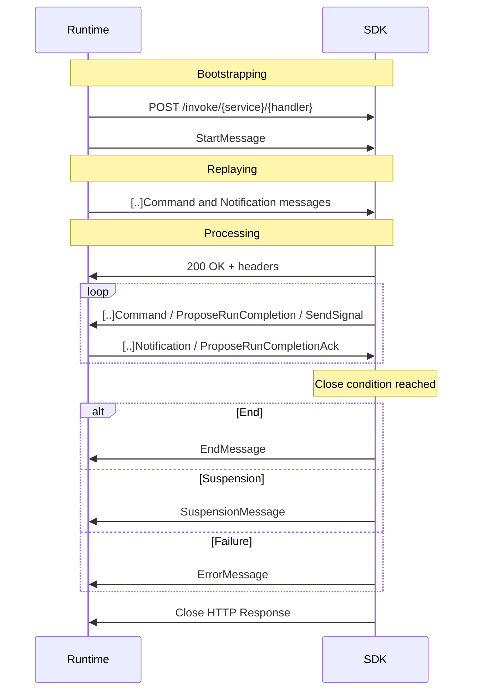

# Restate Service Invocation Protocol

This document specifies the wire protocol used by the Restate runtime to invoke a service handler exposed
by a service deployment.

The protocol is versioned. The current version and the changelog between versions are defined by
`ServiceProtocolVersion` in [`protocol.proto`](dev/restate/service/protocol.proto). This document describes
the latest stable version.

## Architecture

A service deployment is composed of an SDK and the user business logic written on top of it. The runtime
invokes the deployment via HTTP; the SDK implements this protocol and exposes _context APIs_ to user code.

Each invocation is modeled as a state machine whose transitions are recorded in a _journal_. The journal is
the source of truth for the invocation: it captures every observable interaction with the runtime so that
the invocation can be replayed deterministically across failures and restarts.

Runtime and deployment exchange the journal — and runtime-side events — as _messages_ over a single
HTTP stream per invocation.

## HTTP layer

### Path

The runtime opens an HTTP `POST` request against:

```
{prefix}/invoke/{serviceName}/{handlerName}
```

`{prefix}` is implementation-defined and MAY be empty. If the path is malformed, or `serviceName` or
`handlerName` are unknown, the SDK MUST respond with `404`.

### Protocol version negotiation

The runtime selects the protocol version through the `content-type` header:

```
content-type: application/vnd.restate.invocation.vX
```

`X` is the chosen `ServiceProtocolVersion`. If the SDK supports the version, it MUST respond `200` with
the same `content-type`. If it does not, it MUST respond `415`.

### SDK identification

The SDK MAY send back an `x-restate-server` header for observability:

```
x-restate-server: <sdk-name>/<sdk-version>
```

### Transport modes

The stream is layered on top of HTTP and operates in one of two modes:

- **Bidirectional** (HTTP/2 only): messages flow in both directions concurrently.
- **Request/Response**: the runtime first sends all of its messages, then the SDK opens its response
  body and sends messages back. Once the SDK starts writing, the runtime cannot send any further
  messages on that stream.

Both modes share the same framing and semantics; they differ only in the order in which the two sides
may write.

## Stream lifecycle



The stream goes through three phases:

- **Bootstrapping**: the SDK receives `StartMessage` and learns the invocation metadata.
- **Replaying**: the SDK consumes the journal already known to the runtime — `StartMessage.known_entries`
  worth of command and notification messages. User code runs normally, but every interaction with the SDK
  is served from the replayed journal; no new entries are produced.
- **Processing**: the journal is exhausted. The SDK is now the source of truth for new entries. User code
  drives new commands, and the runtime responds with notifications and acks.

The stream MUST end with exactly one of `EndMessage`, `SuspensionMessage`, or `ErrorMessage`. A stream
closed without one of these terminators is treated as if it had ended with an `ErrorMessage` carrying an
unspecified failure code.

`EndMessage` marks the end of the invocation lifecycle — the journal is closed and the invocation has
returned a value or a terminal failure (see [Commands](#commands)).

## Message framing

Each message on the stream is prefixed by a fixed 64-bit header:

    0                   1                   2                   3
    0 1 2 3 4 5 6 7 8 9 0 1 2 3 4 5 6 7 8 9 0 1 2 3 4 5 6 7 8 9 0 1
    +-+-+-+-+-+-+-+-+-+-+-+-+-+-+-+-+-+-+-+-+-+-+-+-+-+-+-+-+-+-+-+-+
    |              Type             |A|         Reserved            |
    +-+-+-+-+-+-+-+-+-+-+-+-+-+-+-+-+-+-+-+-+-+-+-+-+-+-+-+-+-+-+-+-+
    |                             Length                            |
    +-+-+-+-+-+-+-+-+-+-+-+-+-+-+-+-+-+-+-+-+-+-+-+-+-+-+-+-+-+-+-+-+

- **Type** (16 bits): identifies the message kind. See [Message types](#message-types).
- **A** (1 bit, MSB of the flag block): `REQUESTED_ACK` flag. Only meaningful for message types that
  opt into ack semantics (see [Run mechanics](#run-mechanics)). All other types MUST set this bit to zero.
- **Reserved flags** (15 bits)
- **Length** (32 bits): length in bytes of the serialized message payload, excluding the header.

The payload is the [Protobuf-encoded](https://protobuf.dev/programming-guides/encoding/) message
described in [`protocol.proto`](dev/restate/service/protocol.proto).

### Message types

The 16-bit type field is partitioned into namespaces:

| Range           | Namespace                                                                |
|-----------------|--------------------------------------------------------------------------|
| `0x0000–0x03FF` | Control frames (Start, Suspension, End, Error, …)                        |
| `0x0400–0x7FFF` | Commands                                                                 |
| `0x8000–0xFBFF` | Notifications                                                            |
| `0xFC00–0xFFFF` | Custom commands (see [Custom commands](#custom-commands))                |

The authoritative type table lives in [`header.rs`](../src/service_protocol/header.rs).

## Journal model

The journal is an ordered sequence of two kinds of messages:

- **Commands** describe operations the invocation has performed: setting state, calling another service,
  sleeping, running a side effect, etc. Commands are written either by the runtime during replay or by
  the SDK during processing.
- **Notifications** carry asynchronous information delivered _to_ the invocation. They come in two
  flavours — **completions** (results of a previously-issued command) and **signals** (out-of-band
  events not tied to a command). See below.

The relative ordering of notifications delivered by the runtime — completions, signals, and
run-completion acks alike — is significant: on replay the SDK MUST observe the same relative order it
observed when processing. See [Run mechanics](#run-mechanics).

### Notification shape

Every notification message — regardless of whether it is a completion or a signal — conforms to the
duck-type `NotificationTemplate` defined in [`protocol.proto`](dev/restate/service/protocol.proto).

The concrete notification messages (`SleepCompletionNotification`, `CallCompletionNotification`,
`GetLazyStateKeysCompletionNotification`, `SignalNotificationMessage`, …) are not subtypes — they are
distinct messages that share the same field numbers and reserve the subset of `id` and `result`
variants that don't apply. For instance:

| Message                                   | Allowed `id`                  | Allowed `result`              |
|-------------------------------------------|-------------------------------|-------------------------------|
| `SleepCompletionNotification`             | `completion_id`               | `void`                        |
| `GetLazyStateCompletionNotification`      | `completion_id`               | `void`, `value`               |
| `CallCompletionNotification`              | `completion_id`               | `value`, `failure`            |
| `CallInvocationIdCompletionNotification`  | `completion_id`               | `invocation_id`               |
| `GetLazyStateKeysCompletionNotification`  | `completion_id`               | `state_keys`                  |
| `SignalNotificationMessage`               | `signal_id`, `signal_name`    | `void`, `value`, `failure`    |

This shape lets the SDK parse any notification message generically — pick out the id, pick out the
result — and route it to the correct awaiter via a single lookup table.

### Completions

A completion is a notification produced by the runtime as the result of a command. The SDK allocates
one or more `result_completion_id` values at command-creation time and embeds them in the command
message; the runtime sends back a matching notification carrying the same id.

Some commands yield more than one notification, each with its own completion id. `CallCommand`, for
example, allocates two: it first receives a `CallInvocationIdCompletionNotification` (the callee's
invocation id, available as soon as the call is durably enqueued) and later a
`CallCompletionNotification` (the actual call result). The SDK assigns the ids at sys-call time and
exposes them to user code as separate awaitables.

Completion ids are scoped to a single invocation and are opaque to the runtime — round-trip tokens
that the SDK uses to match a result back to the command that produced it.

### Signals

A signal is a notification that is **not** the result of a command. The runtime delivers it
spontaneously, typically because another invocation issued a `SendSignalCommand` targeting this
invocation. Signals are encoded as `SignalNotificationMessage` and addressed in one of two ways:

- by **signal index** — a small reserved namespace defined by `BuiltInSignal` (`CANCEL`, …) and used
  by the runtime to deliver well-known events.
- by **signal name** — an arbitrary user-defined string. Used for application-level signals.

Signals can be combined with completions in suspension future trees: `waiting_completions`,
`waiting_signals`, and `waiting_named_signals` are the three leaf-id sets of `Future` (see
[Suspension and await tracking](#suspension-and-await-tracking)).

## StartMessage

`StartMessage` is the first message of every stream. It carries the metadata required to bootstrap the
invocation state machine:

- `id`, `debug_id`, `key`, `scope`, `limit_key`, `idempotency_key`: invocation metadata.
- `known_entries`: number of command and notification messages the runtime will replay before the SDK
  takes over.
- `state_map` / `partial_state`: see [Eager state](#eager-state).
- `random_seed`: seed for the deterministic RNG exposed in the context API.
- `retry_count_since_last_stored_entry` / `duration_since_last_stored_entry`: retry telemetry.
  Best-effort — may reset across leader changes.

## Commands

The full command catalogue lives in [`protocol.proto`](../service-protocol/dev/restate/service/protocol.proto).
Commands divide into two groups by how they relate to notifications.

### Completable commands

A completable command declares one or more `result_completion_id` fields. The runtime delivers a
matching notification per id at some point in the future.

| Command                       | Notification(s)                                                          |
|-------------------------------|--------------------------------------------------------------------------|
| `GetLazyStateCommand`         | `GetLazyStateCompletionNotification`                                     |
| `GetLazyStateKeysCommand`     | `GetLazyStateKeysCompletionNotification`                                 |
| `GetPromiseCommand`           | `GetPromiseCompletionNotification`                                       |
| `PeekPromiseCommand`          | `PeekPromiseCompletionNotification`                                      |
| `CompletePromiseCommand`      | `CompletePromiseCompletionNotification`                                  |
| `SleepCommand`                | `SleepCompletionNotification`                                            |
| `CallCommand`                 | `CallInvocationIdCompletionNotification` + `CallCompletionNotification`  |
| `OneWayCallCommand`           | `CallInvocationIdCompletionNotification`                                 |
| `RunCommand`                  | `RunCompletionNotification` (see [Run mechanics](#run-mechanics))        |
| `AttachInvocationCommand`     | `AttachInvocationCompletionNotification`                                 |
| `GetInvocationOutputCommand`  | `GetInvocationOutputCompletionNotification`                              |

### Non-completable commands

A non-completable command is a one-shot: writing the command _is_ the action. The runtime does not
respond.

| Command                       | Purpose                                                                              |
|-------------------------------|--------------------------------------------------------------------------------------|
| `InputCommand`                | First entry of the journal; carries the invocation input.                            |
| `OutputCommand`               | Last entry written by the SDK; carries the invocation result or terminal failure.    |
| `SetStateCommand`             | Set a state key.                                                                     |
| `ClearStateCommand`           | Clear a state key.                                                                   |
| `ClearAllStateCommand`        | Clear all state.                                                                     |
| `GetEagerStateCommand`        | Get a state key with the result inlined (see [Eager state](#eager-state)).           |
| `GetEagerStateKeysCommand`    | List state keys with the result inlined (see [Eager state](#eager-state)).           |
| `SendSignalCommand`           | Deliver a signal to another invocation. Also used internally to cancel invocations.  |
| `CompleteAwakeableCommand`    | Resolve a previously-created awakeable in another invocation.                        |

Every command carries an `entry_name` field (`string name = 12`) used by the Restate observability tooling.

### Awakeable identifier

When the SDK creates an awakeable, it MUST surface to user code an id suitable for being handed off to
another invocation. The id is the string `prom_1` concatenated with the
[Base64 URL Safe](https://datatracker.ietf.org/doc/html/rfc4648#section-5) encoding of:

- `StartMessage.id`,
- followed by the awakeable's signal index, encoded as a 32-bit big-endian unsigned integer.

Example: `prom_1NMyOAvDK2CcBjUH4Rmb7eGBp0DNNDnmsAAAAAQ`.

## Run mechanics

`ctx.run` is the durable execution primitive that lets non-deterministic user code write to the journal.
It uses a small dedicated protocol layered on top of the journal model.

1. The SDK records a `RunCommandMessage` with a `result_completion_id`.
2. The SDK executes the user closure.
3. The SDK sends a `ProposeRunCompletionMessage` carrying the result and the same `result_completion_id`.
   This message is **not** itself a notification — it is a proposal that the runtime durably stores and
   then echoes back.
4. The runtime's reply depends on the `REQUESTED_ACK` flag set in the `ProposeRunCompletionMessage` header:
   - `REQUESTED_ACK = 1` — the runtime replies with a `ProposeRunCompletionAckMessage` carrying the
     `completion_id`. SDKs SHOULD set this flag.
   - `REQUESTED_ACK = 0` — the runtime replies with a full `RunCompletionNotificationMessage` carrying
     the result.

`ProposeRunCompletionAckMessage` is ordered relative to other notifications. On replay the SDK MUST
observe the same relative order; the position previously occupied by the ack is now filled by the
`RunCompletionNotificationMessage` that the runtime persisted — the result replaces the ack.

## Suspension and await tracking

An invocation may suspend when it is awaiting one or more notifications that have not arrived yet. To
suspend, the SDK MUST send a `SuspensionMessage` describing the _await point_ as a tree of future
combinators, then close the stream. The runtime resumes the invocation as soon as it has enough new
notifications to potentially unblock the await point.

The await point is a `Future` value:

```
Future {
  combinator_type:        FIRST_COMPLETED | ALL_COMPLETED | ...,
  waiting_completions:    [completion ids],
  waiting_signals:        [signal indexes],
  waiting_named_signals:  [signal names],
  nested_futures:         [Future, ...],   // combined with combinator_type
}
```

`combinator_type` follows JavaScript-style promise combinator semantics:

| Combinator                      | Resolves on                                              |
|---------------------------------|----------------------------------------------------------|
| `FIRST_COMPLETED`               | the first child to complete (success or failure).        |
| `ALL_COMPLETED`                 | every child completing, regardless of outcome.           |
| `FIRST_SUCCEEDED_OR_ALL_FAILED` | the first success; fails only if all children fail.      |
| `ALL_SUCCEEDED_OR_FIRST_FAILED` | all children succeeding; short-circuits on first failure.|

During processing — before suspension is necessary — the SDK MAY send an `AwaitingOnMessage` to inform
the runtime of the current await point. The runtime treats this as a hint for observability and
scheduling, and MUST discard it as soon as a notification covered by the future tree is produced.

## Failures

At the protocol level there are two distinct ways an invocation can fail:

- **As an output**: the invocation ends normally and its result is an `OutputCommandMessage` with the
  `failure` variant set. The journal closes with `EndMessage`. The runtime treats this as a regular
  end state and does not retry.
- **As an `ErrorMessage`**: the SDK closes the stream with an `ErrorMessage`. The runtime treats this
  as an attempt failure and applies its retry policy.

How a user-thrown exception is mapped to one or the other is up to the SDK — typically by
distinguishing "terminal" from "retryable" errors in the user-facing API, but the protocol does not
mandate any particular taxonomy.

### `ErrorMessage`

`ErrorMessage` carries an HTTP-style `code`, a human-readable `message`, and optional
`related_command_index`, `related_command_name`, and `related_command_type` fields locating the
failure in the journal.

Two SDK-specific codes are reserved:

- `570 JOURNAL_MISMATCH` — the SDK cannot replay the journal because its contents diverge from what
  user code expects.
- `571 PROTOCOL_VIOLATION` — the SDK received an unexpected message given its current state.

The runtime owns the retry policy. The SDK MAY influence the next retry attempt by setting:

- `next_retry_delay` (milliseconds) to override the default delay for the next attempt only.
- `should_pause = true` to instruct the runtime to stop retrying and pause the invocation.
  Supersedes `next_retry_delay`.

## Endpoint discovery

The runtime discovers services via a `GET /discovery` request returning an _endpoint manifest_. The
manifest schema lives in [`endpoint_manifest_schema.json`](./endpoint_manifest_schema.json) and is
versioned independently of the invocation protocol, via `ServiceDiscoveryProtocolVersion` in
[`discovery.proto`](dev/restate/service/discovery.proto).

The runtime advertises supported manifest versions through `Accept`:

```
accept: application/vnd.restate.endpointmanifest.v2+json, application/vnd.restate.endpointmanifest.v1+json
```

The SDK MUST reply with the chosen version in `content-type`:

```
content-type: application/vnd.restate.endpointmanifest.v1+json
```

## Eager state

State reads can be served without a runtime round-trip by populating the journal at startup.
`StartMessage.state_map` carries known key/value pairs; `StartMessage.partial_state` indicates whether
the map is exhaustive.

When user code reads key `k`:

- If `k ∈ state_map`: the SDK records a `GetEagerStateCommandMessage` with the result inlined, and
  returns to user code synchronously.
- If `k ∉ state_map` and `partial_state = false`: the SDK records a `GetEagerStateCommandMessage` with
  `void`, and returns _not found_ to user code synchronously.
- If `k ∉ state_map` and `partial_state = true`: the SDK falls back to the lazy path — record a
  `GetLazyStateCommandMessage` and await the corresponding `GetLazyStateCompletionNotificationMessage`.

`SetStateCommand`, `ClearStateCommand`, and `ClearAllStateCommand` MUST also update the SDK's local view
of `state_map` so subsequent reads within the same invocation see the new value.
`GetEagerStateKeysCommand` follows the same pattern for the set of known keys.

## Custom commands

The SDK MAY register custom commands in the `0xFC00–0xFFFF` range. The runtime treats them as opaque
journal entries: it persists them and replays them in order, but does not interpret their payload.
Custom commands MAY carry the `entry_name` field, MUST NOT use proto field numbers 13–15 (reserved for
future use), and MUST NOT set the `REQUESTED_ACK` flag.
